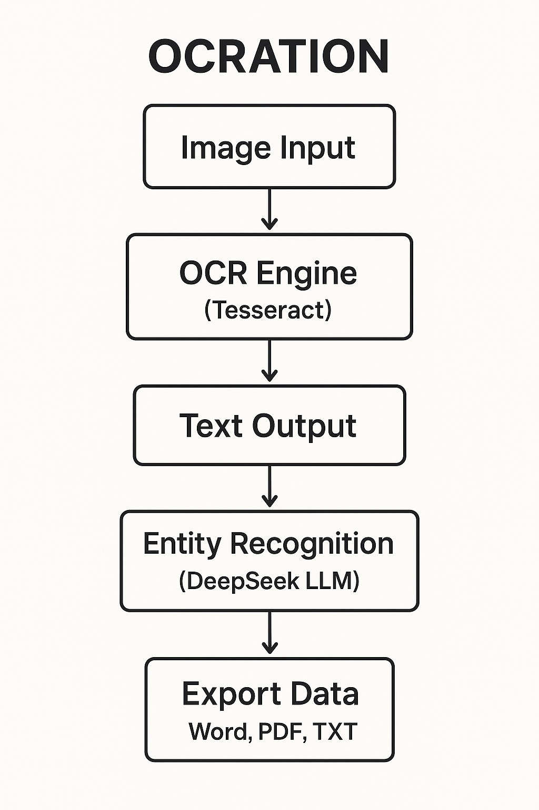

# OCRation — AI-Powered Document OCR & Translation

> Enterprise-grade optical character recognition and neural machine translation system with responsive Flask Web and PyQt5 Desktop interfaces.

[](https://www.python.org/)
[](LICENSE)
[](#)
[](#)

---

## 📖 What This Does

**OCRation** is an AI-powered document intelligence application designed to extract textual content from diverse document images and PDF files with high precision. It seamlessly integrates advanced OCR algorithms with high-speed LLM neural translation powered by the Groq API. OCRation provides two flexible operational modes: an accessible, responsive **Flask Web interface** for network collaboration and a standalone **PyQt5 Desktop GUI** for local execution.

---

## ✨ Key Features

- **Real-time OCR from images and PDF files**: Extract printed and handwritten text with automated image enhancement, contrast adjustment, and noise filtering.
- **LLM-powered translation via Groq API**: Lightning-fast contextual translation into multiple languages using high-performance large language models.
- **Flask web interface**: Modern, accessible UI allowing seamless access from any web browser across your local network.
- **PyQt5 desktop GUI**: Intuitive native desktop application that functions locally without requiring a web browser.
- **Multi-language support**: Out-of-the-box support for Arabic, English, French, Spanish, German, and 10+ additional major languages.
- **Architecture diagram included**: Visual end-to-end data flow documentation illustrating pipeline stages.

---

## 📊 Performance Metrics

| Metric                  | Value          |
|-------------------------|----------------|
| OCR Accuracy (English)  | ~95%           |
| OCR Accuracy (Arabic)   | ~92%           |
| Avg Processing Speed    | ~2–3 sec/page  |
| Supported Languages     | 15+            |
| Interface Options       | Web + Desktop  |

---

## 🏗️ Architecture



Image/PDF → OCR module (Tesseract) → text → LLM (Groq) → translated output → web or desktop display

The pipeline accepts incoming raw document images or PDF pages, applies pre-processing heuristics (adaptive thresholding, CLAHE contrast enhancement, and orientation correction), executes optical character recognition, feeds the normalized text into the Groq LLM translation engine, and renders the synchronized original and translated text across both web and desktop interfaces.

---

## 🚀 Quick Start

### Prerequisites
- **Python 3.8+** installed on your system
- **Tesseract OCR engine** installed:
  - **Linux (Ubuntu/Debian)**: `sudo apt-get install -y tesseract-ocr`
  - **macOS**: `brew install tesseract`
  - **Windows**: Download installer from official UB-Mannheim repository and add to PATH
- **Groq API Key**: Obtain a free API key at [console.groq.com](https://console.groq.com)

### Installation
1. Clone the repository:
   ```bash
   git clone https://github.com/Yuossef-Ashraf/OCRation_App.git
   ```
2. Navigate to the project directory:
   ```bash
   cd OCRation_App
   ```
3. Install dependencies:
   ```bash
   pip install -r requirements.txt
   ```
4. Configure environment variables:
   ```bash
   cp .env.example .env
   ```
5. Open `.env` in your editor and insert your Groq API key:
   ```env
   GROQ_API_KEY=your_actual_groq_api_key_here
   ```

### Run Web App
Start the Flask web server:
```bash
python run_web.py
```
Open your browser and navigate to: `http://127.0.0.1:5000`

### Run Desktop App
Launch the native PyQt5 graphical application:
```bash
python ocration_qt.py
```

---

## 📁 Project Structure

```text
OCRation_App/
├── .github/
│   └── workflows/
│       └── tests.yml                 # Automated CI/CD workflow
├── tests/
│   ├── conftest.py                   # Pytest fixtures and mocks
│   └── test_ocration.py              # Unit and integration test suite
├── web/
│   ├── static/                       # CSS stylesheets, JS scripts, icons
│   └── templates/                    # Jinja2 HTML templates
├── .env.example                      # Sample configuration variables
├── .gitignore                        # Git exclusion rules
├── architecture_flowchart.png        # Architecture pipeline diagram
├── CHANGELOG.md                      # Release notes and history
├── CONTRIBUTING.md                   # Contribution guidelines
├── image_ocr.py                      # OCR engine and image preprocessing
├── llm_model.py                      # Groq LLM integration and translation
├── logging_config.py                 # Structured logging configuration
├── ocration_qt.py                    # PyQt5 Desktop application entrypoint
├── README.md                         # Project documentation
├── requirements.txt                  # Pinned Python package dependencies
└── run_web.py                        # Flask Web application entrypoint
```

---

## 🗺️ Roadmap

- [x] **v1.0** — Core OCR + Translation (Web + Desktop)
- [ ] **v1.1** — Batch processing (multiple files at once)
- [ ] **v1.2** — PDF export of results
- [ ] **v2.0** — REST API for third-party integration

---

## 🤝 Contributing

Contributions are welcome. See [CONTRIBUTING.md](CONTRIBUTING.md) for guidelines. For major changes, open an issue first.

---

## 👤 Author & License

- **Author**: Yuossef Ashraf — GitHub: [@Yuossef-Ashraf](https://github.com/Yuossef-Ashraf)
- **License**: MIT — see [LICENSE](LICENSE)
