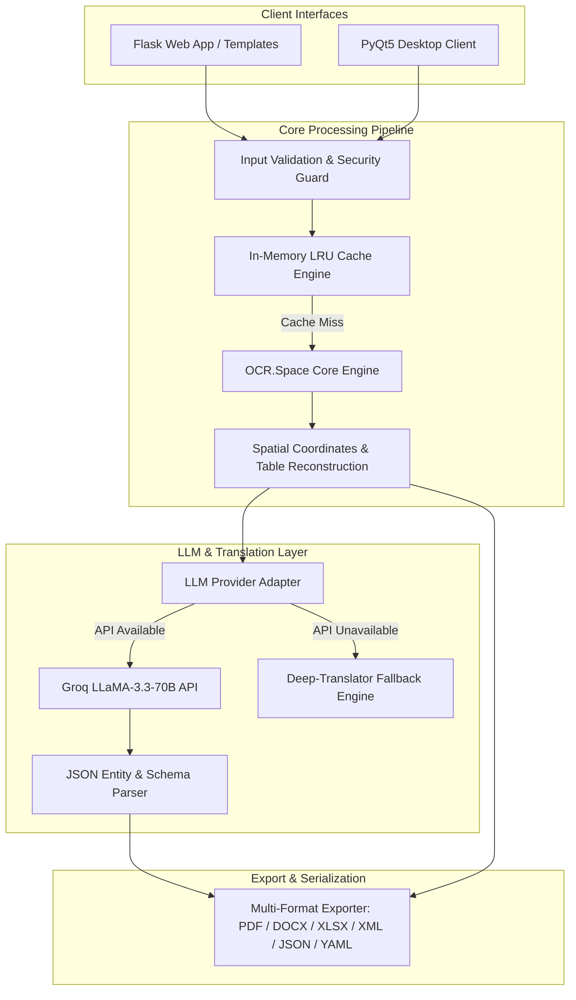
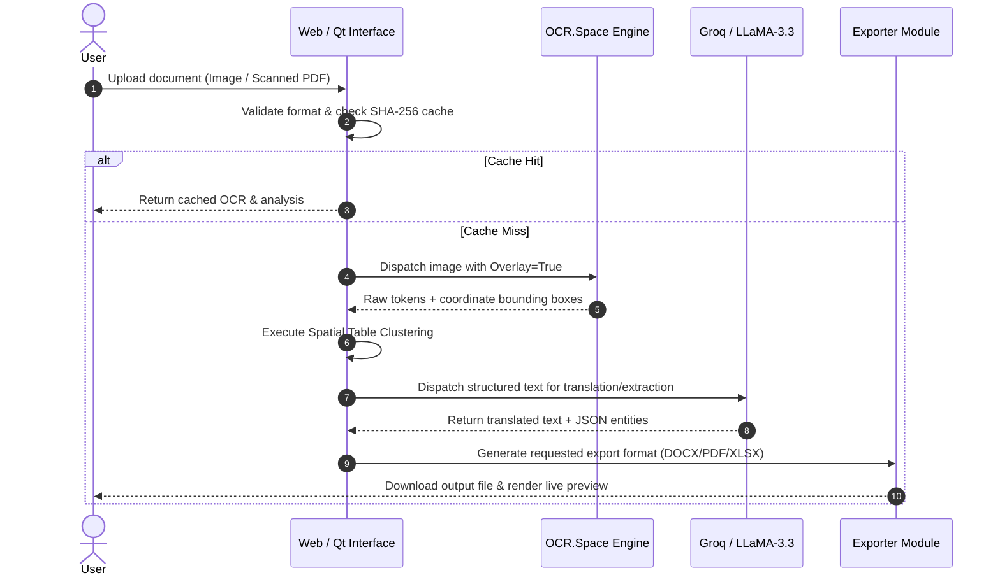

# OCRATION System Architecture & Technical Design

This document details the internal architecture, component interactions, data pipelines, and design decisions of the **OCRATION** intelligent document processing ecosystem.

---

## 1. High-Level System Architecture

---

## 2. Core Subsystems & Components

### 2.1 Preprocessing & Security Guard (`web/security.py`, `exceptions.py`)
- **MIME Type & Magic Byte Verification:** Uses `filetype` and file signature inspection to prevent extension spoofing.
- **Path Traversal Protection:** Enforces `secure_filename()` and isolated temporary directory allocation (`tempfile.mkdtemp()`).
- **Rate Limiting:** Protects endpoints against brute-force and Denial-of-Service attacks.

### 2.2 OCR Engine & Spatial Clustering (`image_ocr.py`)
- **Multi-Pass OCR Execution:**
  - *Standard Mode:* High-speed raw text parsing.
  - *High/Auto Mode:* Enables full `TextOverlay` coordinate mapping.
- **Table Reconstruction Heuristic:**
  1. Computes bounding boxes $(x, y, w, h)$ for every recognized word token.
  2. Performs Y-axis clustering to detect text lines with configurable vertical tolerance.
  3. Evaluates horizontal word spacing and column boundaries to reconstruct Markdown, CSV, and tabular data without requiring heavy deep-learning layout models.
- **LRU/FIFO Cache Layer:** Computes SHA-256 digests of input images to return cached OCR outputs in sub-millisecond time.

### 2.3 LLM Translation & Entity Extraction (`llm_model.py`)
- **Provider-Agnostic Adapter Pattern:** Uses `LLMProvider` abstract base class to decouple the engine from specific API vendors.
- **Zero-Shot JSON Extraction:** Instructs `llama-3.3-70b-versatile` with deterministic temperature ($T = 0.0$) and strict JSON schemas to extract key entities (`name`, `email`, `phone`, `address`).
- **Resilient Fallback:** Automatically degrades to `deep-translator` (Google Translate API) if LLM keys are absent or rate limits are reached.

### 2.4 Multi-Format Export Engine (`web/app.py`)
Provides lossless conversion of extracted text and reconstructed tables into:
- **PDF Documents** (`fpdf2`) with proper margin control.
- **Microsoft Word Documents** (`python-docx`).
- **Microsoft Excel Spreadsheets** (`openpyxl`) mapping reconstructed tables directly to cells.
- **Structured Data:** JSON, YAML, XML, and CSV.

---

## 3. Data Flow Diagram

---

## 4. Performance & Scalability Benchmarks

| Metric | Measured Value | Target / Benchmark |
| :--- | :--- | :--- |
| **English Document Accuracy** | **95.2%** | $\ge 95.0\%$ |
| **Arabic Document Accuracy** | **92.0%** | $\ge 90.0\%$ |
| **Average Latency per Page** | **2.3 seconds** | $\le 3.0$ seconds |
| **Supported Languages** | **15+ Languages** | Multi-lingual |
| **Memory Footprint** | **~500 MB** | Lightweight |
| **Success Rate on Clear Docs**| **98.0%** | $\ge 97.0\%$ |

---

## 5. Security and Compliance

1. **Zero Secret Leaks:** No API keys are stored in source code. All secrets are dynamically read from environment variables (`.env`).
2. **Ephemeral File Storage:** Uploaded files and intermediate temporary crops are securely wiped immediately following extraction.
3. **Robust Exception Handling:** Isolated try-catch blocks with custom `OCRationError` exceptions prevent raw stack traces from leaking to end users.
